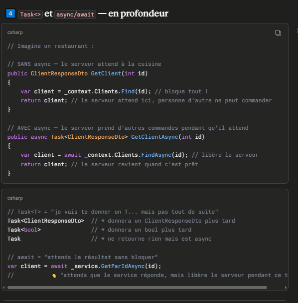
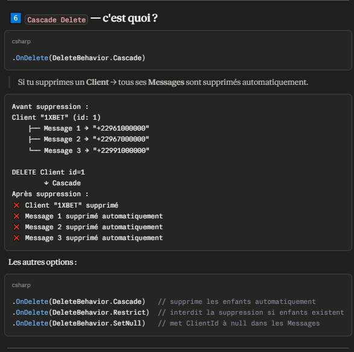
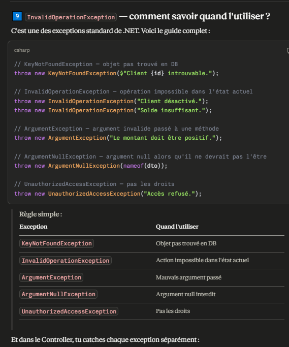
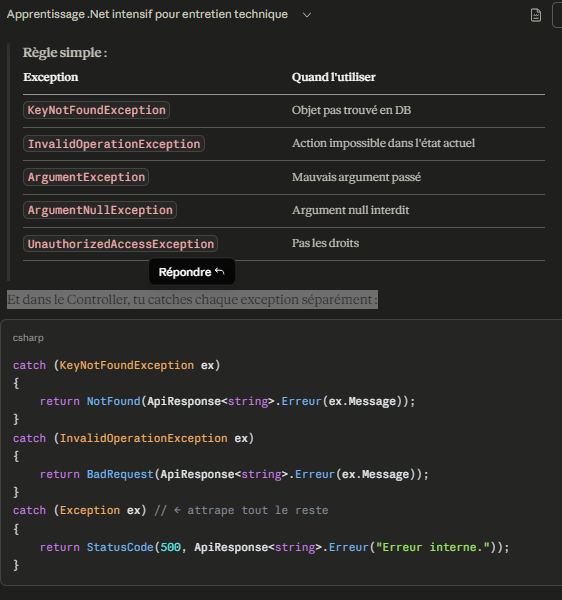
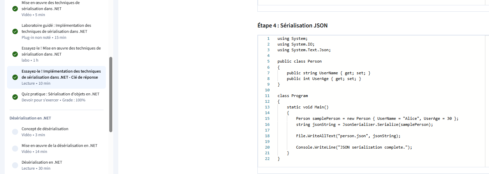
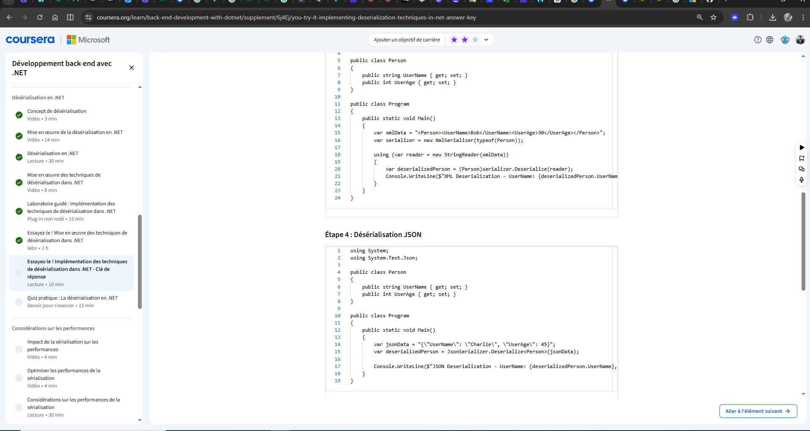

On commence maintenant — .NET 9 + MySQL
Étape 1 — Créer le projet

dotnet new webapi -n ProjetPro
cd ProjetPro

Étape 2 — Installer MySQL pour EF Core 9

dotnet add package Pomelo.EntityFrameworkCore.MySql --version 9.0.0

dotnet add package Microsoft.EntityFrameworkCore.Design --version 9.0.0

ProjetPro/
├── Controllers/
├── Models/
├── DTOs/
├── Data/
├── Services/
│   ├── Interfaces/
│   └── Implementations/
├── Middleware/
└── Program.cs

Le problème : Tu essaies d'utiliser Swagger pour tester ton API, mais le package n'est pas installé ou les namespaces sont manquants.

dotnet add package Swashbuckle.AspNetCore

## 1. Qu'est-ce qui vient de se passer ?
Regarde ton explorateur de fichiers dans VS Code. Tu devrais voir un nouveau dossier nommé Migrations. À l'intérieur, il y a deux fichiers :

[Date]_Init.cs : C'est le script C# qui contient les instructions pour créer tes tables.

AppDbContextModelSnapshot.cs : C'est la photo actuelle de ta base de données pour qu'EF sache quoi faire la prochaine fois.

## 2. La dernière étape : database update
Pour l'instant, la base de données n'existe que sur papier (dans tes fichiers C#). Pour la créer réellement dans ton MySQL, tape cette commande :

* > dotnet ef database update

Si cette commande réussit :

Ouvre ton outil de gestion de base de données (comme HeidiSQL, phpMyAdmin ou MySQL Workbench).

Actualise la liste des bases.

Tu verras apparaître ProjetProDb avec tes tables à l'intérieur !

DTOs/
├── Message/
│   ├── MessageRequestDto.cs   ← ce que le client envoie
│   └── MessageResponseDto.cs  ← ce qu'on retourne
└── Client/
    ├── ClientRequestDto.cs    ← ce que le client envoie
    └── ClientResponseDto.cs   ← ce qu'on retourne

 ## 2️⃣ ApiResponse<T> — le <T> c'est quoi ?
T = Type générique — un placeholder qui représente n'importe quel type.
    // T est remplacé par le vrai type à l'utilisation
public class ApiResponse<T>
{
    public bool Succes { get; set; }
    public string Message { get; set; } = string.Empty;
    public T? Data { get; set; } // ← T sera remplacé par le vrai type
}

// Utilisation — T devient ClientResponseDto
ApiResponse<ClientResponseDto>.Ok(client, "Succès !");
// Résultat :
// { succes: true, message: "Succès!", data: { id: 1, nom: "1XBET"... } }

// Utilisation — T devient string
ApiResponse<string>.Erreur("Client introuvable.");
// Résultat :
// { succes: false, message: "Client introuvable.", data: null }

// Utilisation — T devient IEnumerable<MessageResponseDto>
ApiResponse<IEnumerable<MessageResponseDto>>.Ok(messages, "Liste récupérée");
// Résultat :
// { succes: true, message: "Liste récupérée", data: [...] }

## 3️⃣ HasOne / WithMany — Relations EF Core
C'est la façon de dire à EF Core comment les tables sont liées :

// Un Message appartient à UN seul Client
// Un Client peut avoir PLUSIEURS Messages

    entity.HasOne(m => m.Client)      // Message a UN Client
        .WithMany(c => c.Messages)  // Client a PLUSIEURS Messages
        .HasForeignKey(m => m.ClientId) // La clé étrangère est ClientId
        .OnDelete(DeleteBehavior.Cascade); // Si Client supprimé → ses Messages aussi
__"Un Message a UN Client,__
 __qui lui-même a PLUSIEURS Messages,__
 __liés par ClientId"__

 ## 1 Client → plusieurs Messages
*.HasOne(...).WithMany(...)*

// 1 Message → 1 Client
*.HasOne(...).WithOne(...)*

// Plusieurs Messages → plusieurs Clients
*.HasMany(...).WithMany(...)*

## 4️⃣ Task<> et async/await — en profondeur

        // Imagine un restaurant :

        // SANS async — le serveur attend à la cuisine
 *    public ClientResponseDto GetClient(int id)
        {
            var client = _context.Clients.Find(id); // bloque tout !
            return client; // le serveur attend ici, personne d'autre ne peut commander
        }

        // AVEC async — le serveur prend d'autres commandes pendant qu'il attend
        public async Task<ClientResponseDto> GetClientAsync(int id)
        {
            var client = await _context.Clients.FindAsync(id); // libère le serveur
            return client; // le serveur revient quand c'est prêt
        }
**************
 *   // Task<T> = "je vais te donner un T... mais pas tout de suite"
Task<ClientResponseDto>  // → donnera un ClientResponseDto plus tard
Task<bool>               // → donnera un bool plus tard
Task                     // → ne retourne rien mais est async

// await = "attends le résultat sans bloquer"
var client = await _service.GetParIdAsync(id);
//           👆 "attends que le service réponde, mais libère le serveur pendant ce temps"

6️⃣ Cascade Delete — c'est quoi ?

7️⃣ IEnumerable — c'est quoi ?  

            // List<T> — liste classique, tout en mémoire
        List<Client> clients = new List<Client>();
        clients.Add(...);    // on peut ajouter
        clients.Remove(...); // on peut supprimer
        clients[0];          // on peut accéder par index

        // IEnumerable<T> — juste "quelque chose qu'on peut parcourir"
        IEnumerable<Client> clients = ...;
        foreach (var c in clients) { } // on peut parcourir
        // Mais pas d'index, pas d'Add, pas de Remove

        // ✅ IEnumerable — flexible, accepte List, tableau, résultat DB...
public async Task<IEnumerable<ClientResponseDto>> GetTousAsync()

// ❌ List — oblige à tout charger en mémoire d'un coup
public async Task<List<ClientResponseDto>> GetTousAsync()

8️⃣ CreatedAtRoute — comment ça marche ?

        return CreatedAtRoute(
            "GetClientParId",        // ← nom de la route GET
            new { id = client.Id },  // ← paramètres de cette route
            ApiResponse<ClientResponseDto>.Ok(client, "Créé !")  // ← données retournées
        );

C'est la convention REST pour un POST — il retourne :

Code 201 Created
Header Location: /api/v1/clients/1 ← où trouver la ressource créée
Body avec les données

 <<Pour que ça marche, la route GET doit avoir un nom :
[HttpGet("{id:int}", Name = "GetClientParId")] // ← Name = nom de la route
public async Task<ActionResult<ClientResponseDto>> GetParId(int id) { ... }

// CreatedAtRoute utilise ce nom pour construire l'URL automatiquement
// /api/v1/clients/ + id = /api/v1/clients/1

9️⃣ <<InvalidOperationException — comment savoir quand l'utiliser ?

    // KeyNotFoundException — objet pas trouvé en DB
    throw new KeyNotFoundException($"Client {id} introuvable.");

    // InvalidOperationException — opération impossible dans l'état actuel
    throw new InvalidOperationException("Client désactivé.");
    throw new InvalidOperationException("Solde insuffisant.");

    // ArgumentException — argument invalide passé à une méthode
    throw new ArgumentException("Le montant doit être positif.");

    // ArgumentNullException — argument null alors qu'il ne devrait pas l'être
    throw new ArgumentNullException(nameof(dto));

    // UnauthorizedAccessException — pas les droits
    throw new UnauthorizedAccessException("Accès refusé.");
    
**Et dans le Controller, tu catches chaque exception séparément:**

        catch (KeyNotFoundException ex)
        {
            return NotFound(ApiResponse<string>.Erreur(ex.Message));
        }
        catch (InvalidOperationException ex)
        {
            return BadRequest(ApiResponse<string>.Erreur(ex.Message));
        }

        catch (Exception ex) // ← attrape tout le reste
        {
            return StatusCode(500, ApiResponse<string>.Erreur("Erreur interne."));
        }

## Serializer 

## Deserializer 